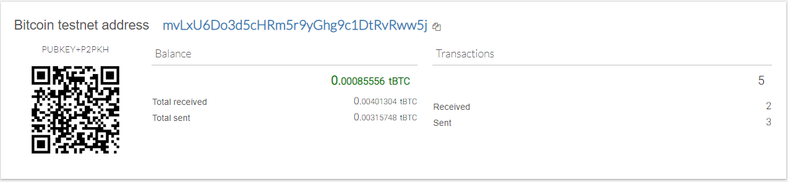
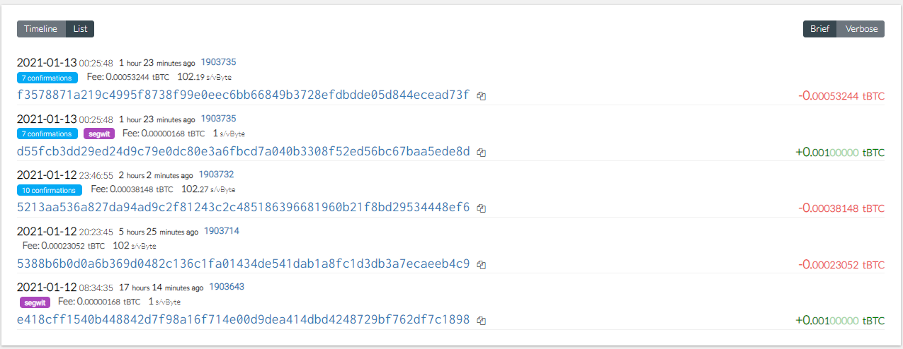
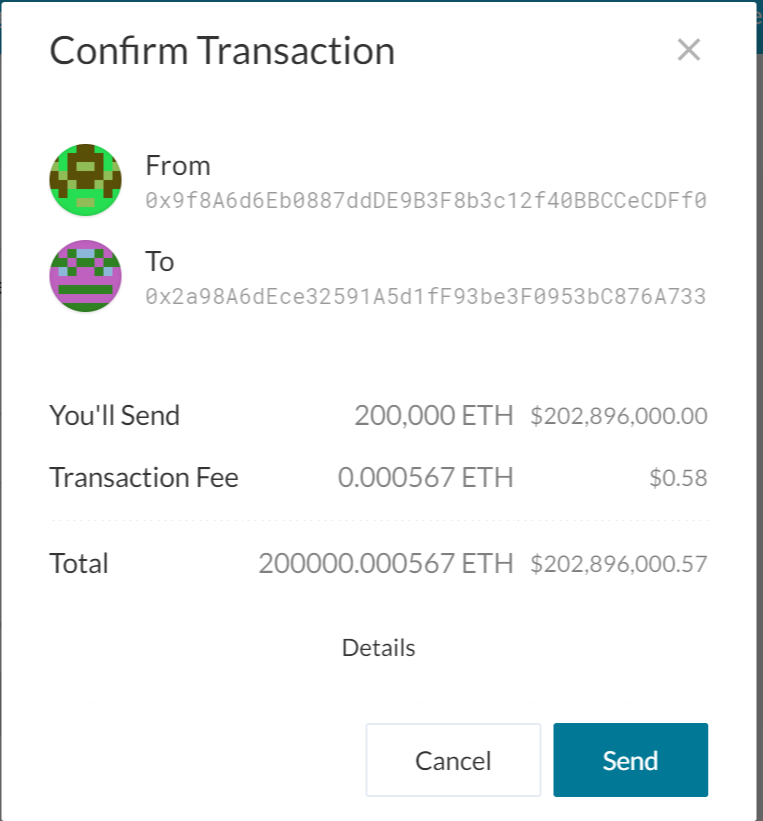
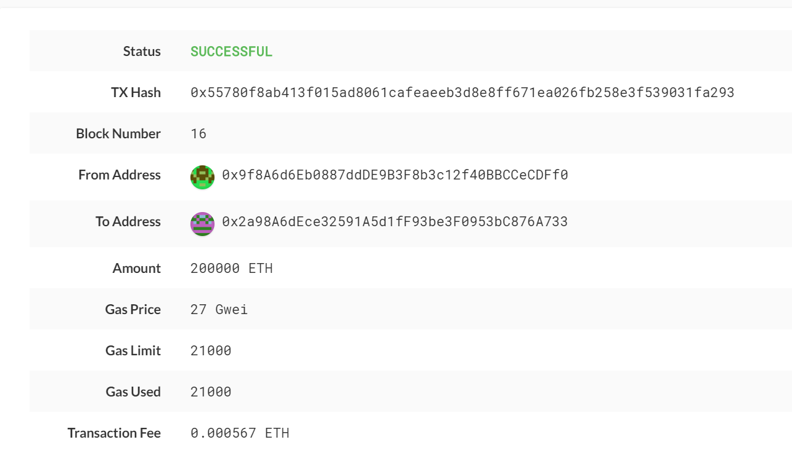

# Blockchain Python

The purpose of this project is to derive wallets for Ethereum and Bitcoin test networks and send transactions. For this purpose, hd-wallet-derive tool was used, along with bit and web3 libraries.

This was achieved by using functions one each for deriving wallets, creating a transaction, sending a transaction and converting the private keys to objects that can be used by bt and web3 to transact.

To understand more about the functions:

1. priv_key_to_account

This will convert the privkey string in a child key to an account object that bit or web3.py can use to transact.

This function needs the following parameters:

1. coin -- the coin type (defined in constants.py).

2. priv_key -- the privkey string will be passed through here.

For ETH, return Account.privateKeyToAccount(priv_key)

For BTCTEST, return PrivateKeyTestnet(priv_key)

2. create_tx

This will create the raw, unsigned transaction that contains all metadata needed to transact.
This function needs the following parameters:

1. coin -- the coin type (defined in constants.py).

2. account -- the account object from priv_key_to_account.

3. to -- the recipient address.

4. amount -- the amount of the coin to send.

For ETH, return an object containing to, from, value, gas, gasPrice, nonce, and chainID.

For BTCTEST, return PrivateKeyTestnet.prepare_transaction(account.address, [(to, amount, BTC)])

3. send_tx

This will call create_tx, sign the transaction, then send it to the designated network.
This function needs the following parameters:

1. coin -- the coin type (defined in constants.py).

2. account -- the account object from priv_key_to_account.

3. to -- the recipient address.

4. amount -- the amount of the coin to send.

For ETH, return w3.eth.sendRawTransaction(signed.rawTransaction)

For BTCTEST, return NetworkAPI.broadcast_tx_testnet(signed)

These functions are used to create and send transactions for the accounts which were generated using the 12 word mnemonic.

Before creating the transactions, the btc test net is funded using faucet (maximum of 0.01 is fauceted in to account)

For creating transactions in ETH, the addresses from the derive wallets function are used to run a block chain and through which the addresses are funded. After that, a transaction is made among the generated addresses and verified.

After sending the transactions, it was verified in block explorer for the BTC testnet transactions, and in MyCrypto application for ETH transactions.

Transaction verification for BTC testnet

Transaction timeline for BTC testnet

Transaction creation for ETH

Transaction status for ETH

Installations:

[Bit/Web3 Install Guide](Blockchain_TX_Install_Guide.md)

[HD-Wallet-Derive Install Guide](HD_Wallet_Derive_Install_Guide.md)

